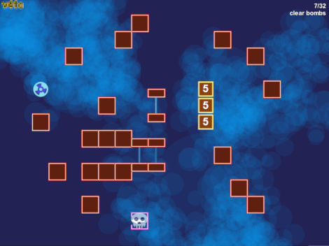

# Boxitus

This is a clone of the game [Orbox B](http://www.notdoppler.com/orboxb.php) with some minor deviations.

The goal is to find a way to the exit. The exit may be closed until all bombs have been cleared and all sensors have been activated.

The original game is great fun too, but requires the Adobe Flash plugin. Boxitus is pure HTML5 and JavaScript and was tested in Firefox and Chrome.

## It's online!

http://www.engehausen.de/jan/bx.html

If you know a level code, you can enter it on the main screen to jump directly to that level. Otherwise a click will run the first level.
On a desktop you can move the player with the cursor keys. The space bar will restart the level should you hit a dead-end.

There is rudimentary support for mobile devices using the motion sensor. You can hold the device flat (i.e. its underside is facing the ground) or upright. In both cases you must hold it in landscape mode. It is recommended to turn off auto-rotation.

## Building the game

You'll need Typescript - you can install it via `npm install -g typescript`. Make sure the dependencies are resolved by running `npm install`.
Then execute `npm run build --production` to build the game. Open `src/index.html` in a browser; this gives will run the game.

## Building the editor

This is a hybrid npm and Maven project. The editor is written in Java. To build and run it execute

	mvn -Prun verify

The levels are located in `src/main/resources/`. If you plan to change or add to them you will need to create a data URL in the editor and put it into [`src/Levels.ts`](src/Levels.ts).

The editor also has a rudimentary "solver" to check if a level can be solved (_all levels shipped are solvable_). Levels may still be solvable even if the solver fails to find solutions.

### Screenshots

Editor

Solver

